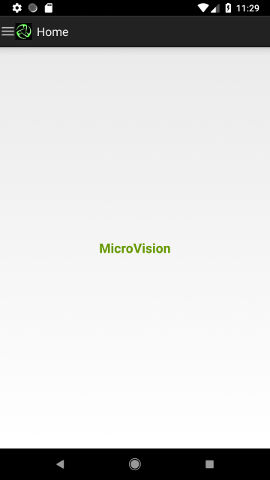
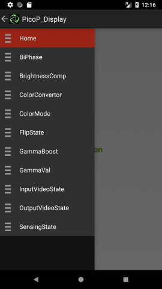
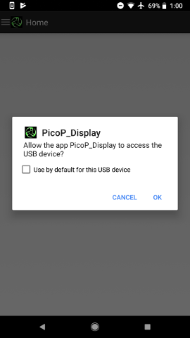
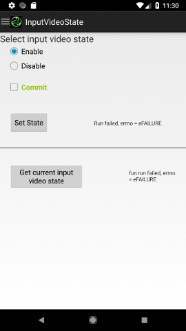
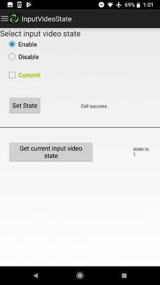

PicoP Display Demo App
=========================

Introduction
------------
The goal of this sample app is to show how to use PicoP Android SDK Display API's. This sample app demonstrates the use of all the existing Control API's. 

DevKit Setup
------------
Please refer to the DevKit User Guide for identifying the usb control ports. 

SDK Library
------------
Library is available as \lib\PicoP.aar
In order to use it in a custom app, please refer to Android guide to add it as a dependency in the project
- https://developer.android.com/studio/projects/android-library#AddDependency

SDK Documentation and Connection Flow
--------------------------------------
Documentation : \JavaDoc\


First step is to create PicoP_Handle USB handle. Android application context has to be passed to the connection for subsequent API calls. Secondly set PicoP_Handle to PicoP_OpenLibrary call. After successful return from this call create a connection to the DevKit by calling PicoP_OpenConnection API. 
```java
Context appContext = InstrumentationRegistry.getTargetContext();

PicoP_LibraryInfoS libraryInfo = new PicoP_LibraryInfoS();
PicoP_Handle connectionHandle = new PicoP_Handle(eUSB);
PicoP_Api picopApi = new PicoP_API();
PicoP_ConnectionInfo connectionInfo = connectionHandle.getConnectInfo();
connectionInfo.setConnectionContext(appContext);

PicoP_RC result = picopApi.PicoP_OpenLibrary(connectionHandle);

ret = picopApi.PicoP_OpenConnection(connectionHandle, PicoP_ConnectionTypeE.eUSB, connectionInfo);
```
Once we have the connection handle we can send the API request as shown below for PicoP_SetInputVideoState
```java
 PicoP_RC result = picopApi.PicoP_SetInputVideoState(mPicoPHandler,
                                                        PicoP_InputVideoStateE.eINPUT_VIDEO_ENABLED,
                                                        true);
 ```
 Do remember to close the connection on application close.
 ```java
 PicoP_RC result = picopApi.CloseConnection(libraryHandle.connectionInfoEx.getConnectionType());
 ```

Build Environment
-----------------
- Tested on Ubuntu 16.04 and Windows 10, 64 bit workstation
- Android Studio 3.4.1
- Android PixelXL running 8.1.0 
- USB + OTG cable (No UART support)
- Development Kit

Getting Started
---------------
Set up and install Android studio 3.4.1 based on the instructions found here:
  - https://developer.android.com/studio/install
  
To build the project in Android Studio select "Import Project". Select the location of downloaded/cloned PicoP_Display directory from your workstation and press "OK". This project uses Gradle and it may take few minutes for Gradle to sync and update the build environment. 

Building and Running test app 
------------------------------
Run/Install the app on the device based on the instructions found here:
- https://developer.android.com/studio/run/device

Alternatively we can use adb tool to install prebuilt apk. APK can be found in PicoPAndroidSDK/samples/bin/. For information on adb tool installation for various platforms refer to:
- https://developer.android.com/studio/command-line/adb

Before installing app on a device, enable USB debugging on the device. This is under Settings > Developer options.
Note: On Android 4.2 and newer, Developer options is hidden by default. To make it available, go to Settings > About phone and tap Build number seven times. Return to the previous screen to find Developer options.
Once device is set up and connected via USB, install the app using the adb tool: 
- adb -d install path/to/_app.apk


After installation is completed, connect the Dev Kit USB connectors to the Android device using OTG. Provide USB permissions for the app in the pop up as shown in the USB permissions screenshot below.
If there is an issue with USB permissions, there will be error message seen when the user executes a get/set control command.







