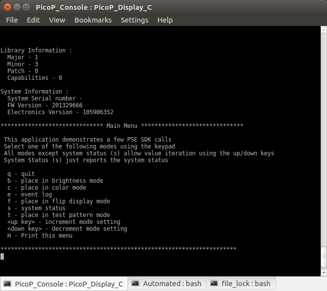

# PicoP Linux SDK #

This repo provides the SDK library binaries, demo application source code and instructions on how to get started with the PicoP Software Development Kit (SDK) for Linux. The PicoP SDK for Linux allows developers to quickly and easily integrate PicoP device control into a Linux application. Linux Applications can communicate with PicoP device over a USB connection. 

## Source Code Installation

Clone this repo. 

### Directory Description

The directory structure is detailed below :

```console
└── PicoP_Linux_SDK
    ├── Docs                                            // SDK Documentation
    │   ├── DA0140028_PicoP_Gen4_Programmers_Guide.pdf  // High Level Programmer’s Guide
    │   ├── EULA.pdf                                    // SDK End User License Agreement
    │   └── Reference_Guide                             // Detailed Programmer’s Reference Guide
    ├── images                      // Images used by this readme
    ├── Interface                   // PicoP SDK API Interface
    ├── Lib                         // PicoP SDK Linux libraries (64-bit)
    └── Samples                     // SDK Sample Applications
        ├── Bin                     // Contains the 64-bit executables for the sample applications.
        ├── PicoP_Console           // Simplest Console application demonstrating how to communicate with PSE
        ├── PicoP_Display           // Simple GUI Application demonstrating the basic usage of sample C APIs for Display functions
        │   └── glade               // GTK+ UI file
        └── PicoP_Update_FW         // Simplest Console application demonstrating how to perform a FW update on the PSE
```

#### Required Platform Packages

Each Linux platform requires the installation of the following packages : 

- libudev-dev, (GNU Lesser General Public License (LGPL), version 2.1) 
- libbluetooth-dev, (GNU General Public License (GPL))
- libusb-1.0-0-dev, (GNU Lesser General Public License (LGPL), version 2.1)
- v4l-utils, (GNU Lesser General Public License)
- build-essential
- git

#### Library Usage

To build with the static library, explicity link with the libPicoP_Api.a library.

There is no Advanced Packaging Tool (APT) package created for shared library installation. To evaluate the shared library, softlink creation is required to traverse the versions of the soname. For example, if released version is libPicoP_ALC_Api.so.1.3.0 then create following softlinks in library path directory :

```console
$ sudo ln -sf libPicoP_Api.so.1.3.0 libPicoP_Api.so.1.3
$ sudo ln -sf libPicoP_Api.so.1.3 libPicoP_Api.so.1
$ sudo ln -sf libPicoP_Api.so.1 libPicoP_Api.so
```

See the PicoP Console demo makefile for and example of static and dynamic library usage.

## Demo Applications

PicoP\_Linux\_SDK/samples/ contains demo applications utilizing the PicoP SDK:

- PicoP_Console
- PicoP_Display

To build any of these applications, open a shell and navigate to the application directory and execute "make". This will build the application using the static library.

The library utilizes USB device node access for display communication. This requires running all demo applications under sudo access control or create udev rules to allow user space programs access to usb device nodes. There are several ways to create the udev rules, but one simple rule set which allows device node access to any user on the host is the following 2 lines :

- SUBSYSTEMS=="usb", ENV{DEVTYPE}=="usb_device", ATTRS{idVendor}=="148a", ATTRS{idProduct}=="0004", MODE="0666"
- SUBSYSTEMS=="usb", ENV{DEVTYPE}=="usb_device", ATTRS{idVendor}=="04b4", ATTRS{idProduct}=="00f9", MODE="0666"

Add these 2 lines to a udev file (filename extension .rules) located in /etc/udev/rules.d. Note if your chosen filename exists in /lib/udev/rules.d directory those rules will be overridden, so it is advisable to choose a unique filename for these udev rules.

### PicoP_Console

The PicoP\_Display\_Console\_Demo application is a simple interactive command line console app to exercise a few Display control API functions. 

To build using a static library invoke make with no arguments :
```console
$ make
```

To build using a shared library, configure softlinks as detailed above, and invoke make with the STATIC argument :

```console
$ make STATIC=false
```

Insert the Dev Kit USB connectors into the Linux Host machine and issue “sudo ./PicoP\_Display\_Console\_Demo” at the shell command line to run the application. As shown below, Library and System information will be displayed in the shell followed by help instructions. Select one of the supported modes, and then press the up key (key value 65) or down key (key value 66) to cycle though configurations for that mode. 



### PicoP_Display

The PicoP_Display_GUI_Demo application presents a GUI to exercise several more of the Display control API functions. 

Installation of the following platform package is required for this application :

- libgtkmm-3.0-0-dev, (version >= 3.18.0-1) (GNU Lesser General Public License)

Insert the Dev Kit USB connectors into the Linux Host machine and issue “sudo ./PicoP_Display_GUI_Demo” at the shell command line to run the application. As shown below, a GUI application launches with supported commands enumerated on the left side of the pane. Selecting a command mode radio button will show its control widgets on the right side of the pane. 


## Host Platforms Evaluated

The PicoP Gen4 SDK and applications has been verified on the following hardware platforms ("$ cat /etc/os-release", "$ uname -r"): 

- PC : Ubuntu Linux 16.04 
    - DISTRIB_ID=Ubuntu
    - DISTRIB_RELEASE=16.04
    - DISTRIB_CODENAME=xenial
    - DISTRIB_DESCRIPTION="Ubuntu 16.04.5 LTS"
    - NAME="Ubuntu"
    - VERSION="16.04.5 LTS (Xenial Xerus)"
    - ID=ubuntu
    - ID_LIKE=debian
    - PRETTY_NAME="Ubuntu 16.04.5 LTS"
    - VERSION_ID="16.04"
    - HOME_URL="http://www.ubuntu.com/"
    - SUPPORT_URL="http://help.ubuntu.com/"
    - BUG_REPORT_URL="http://bugs.launchpad.net/ubuntu/"
    - VERSION_CODENAME=xenial
    - UBUNTU_CODENAME=xenial
    - kernel version: 4.15.0-36-generic
